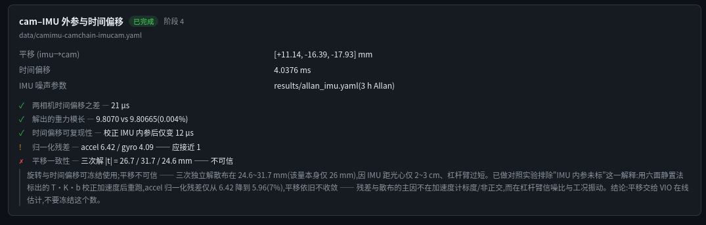
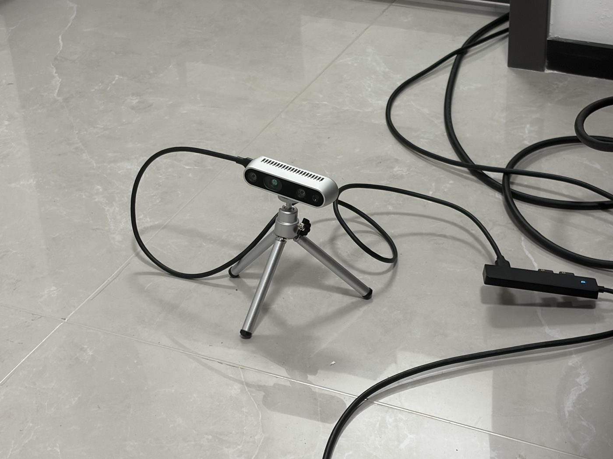
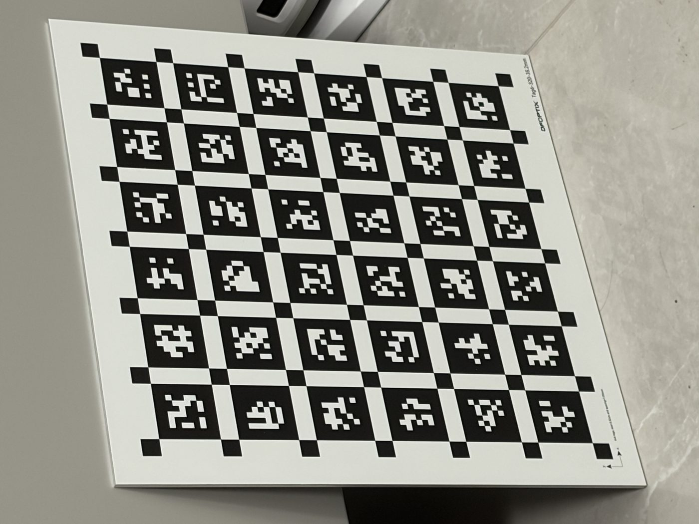
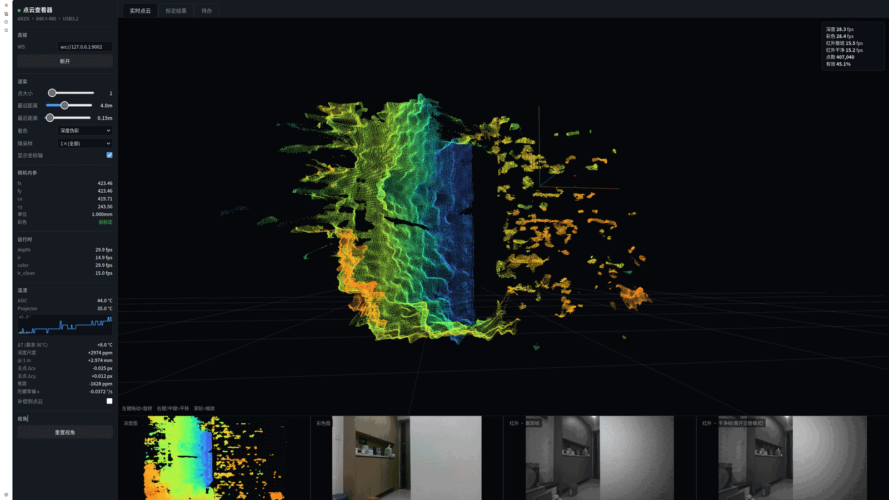
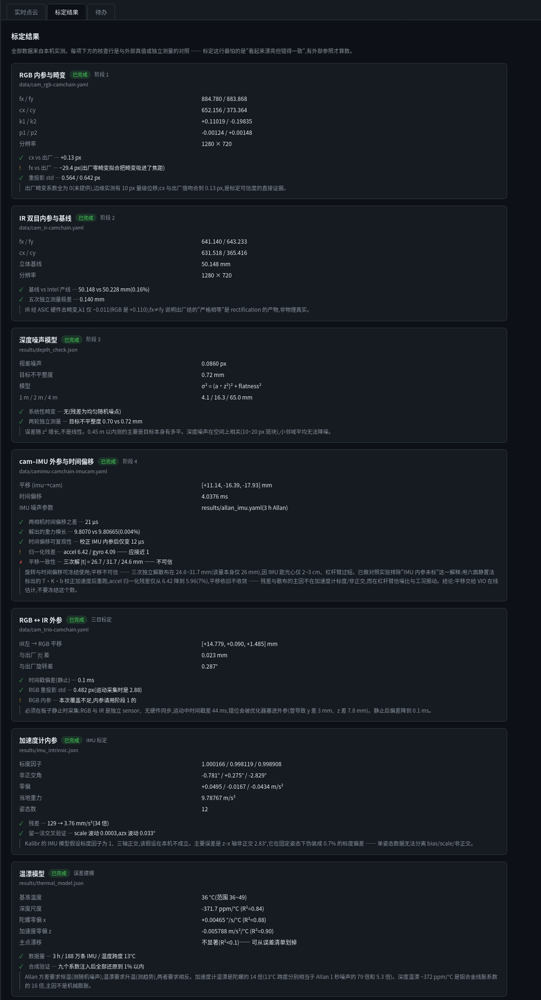

# RGBD-FullCalib

**Building a one-stop, multi-sensor calibration workbench — where every parameter
(camera, IMU, LiDAR, cross-sensor) comes back with a verdict: checked against
references from *outside* the optimization, visualized, and flagged before a bad
number ever reaches your SLAM stack. v0.1 ships the first full instance: one
Intel RealSense D435i, end to end. The [roadmap](ROADMAP.md) goes much further.**

[中文版 README](README_zh.md) · field notes [CALIBRATION.md](CALIBRATION.md) (Chinese) ·
error propagation [IMPACT_ANALYSIS.md](IMPACT_ANALYSIS.md) (Chinese) ·
[ROADMAP](ROADMAP.md) · [CHANGELOG](CHANGELOG.md)



Calibration's worst failure mode is **looking beautiful while being consistently wrong**.
Reprojection error tells you the model fits the data it was fitted to — nothing more.
So every result here is checked against something *outside* the optimization:
factory parameters, local gravity, repeated independent captures, a ruler.
And when a parameter fails its check, the tool says so — the red row above is this rig's
camera–IMU translation, shipped with the verdict *"do not freeze this number,
let your VIO estimate it online."*

## Where this is going

The endgame is the calibration workbench that doesn't exist yet: describe your
rig, capture with guidance, calibrate everything — intrinsics, IMU, LiDAR,
cross-sensor extrinsics, time sync — and trust the output because every number
carries its own verdict. Kalibr stops at vision+IMU; vendor tools are black
boxes; the rest is scattered scripts and blog folklore. Full vision and version
plan: [ROADMAP.md](ROADMAP.md).

**v0.1, shipped**: one camera end to end (RGB intrinsics → stereo IR → RGB↔IR
extrinsics → depth noise model → camera-IMU → accelerometer intrinsics → thermal
drift model), with the tools, the verdict layer, the GUI, and ~15 documented
pitfalls that cost real hours.

The seams for what's next are already in the code: about half the tools are
device-agnostic (marked in the layout below), the viewer's source abstraction
was built for a sensor that isn't a camera (a native point-stream channel is
reserved for the Mid-360 on its way), and v0.2 turns the verdict checks into
declarative rules so a new device means new rules, not forked code.

### Bring your camera

If you run any stage on a different RGB-D / visual-inertial rig and hit a wall,
open an issue with the traceback — real breakpoints, not guesses, decide what
v0.2+ abstracts first. There is a standing issue for exactly this.

## The rig

| | |
|---|---|
|  |  |
| Intel RealSense D435i, fw 5.12.7.100, USB 3.2 | DFOPTIX `Tag6-320-35.2mm` AprilGrid on a rigid board |

The target is a manufactured board, not a home print — which matters: it rules out
print-scaling as an error source, so residuals trace to detection and to the camera,
not to the ruler. `tagSpacing = 0.3` was confirmed four independent ways
(ruler-measured 10.6 mm gap, the part number, the Kalibr default, and a
reprojection-error sweep with a clear minimum at 0.30).

## Results at a glance

| Stage | Key numbers | External check | Verdict |
|---|---|---|---|
| RGB intrinsics | fx/fy 884.8/883.9, reproj σ 0.56 px | principal point vs factory: 0.13 px | ✅ freeze |
| Stereo IR + baseline | baseline 50.148 mm | vs factory 50.228 mm (0.16%); 5 independent captures within 0.14 mm | ✅ freeze |
| RGB↔IR extrinsics | \|t\| diff vs factory 0.023 mm, rot 0.287° | factory calibration | ✅ freeze |
| Depth noise model | σ² = (a·z²)² + flatness², σ = 4.1/16.3/65 mm @ 1/2/4 m | two rounds, target flatness cross-checked | ✅ use as weights |
| Camera–IMU | timeshift 4.04 ms; rotation ~1° class | solved gravity 9.8070 vs local 9.80665; RGB/IR timeshift agree to 21 µs | ⚠️ freeze rotation + timeshift only |
| Camera–IMU **translation** | three independent solutions spread 24.6–31.7 mm | the quantity itself is ~26 mm | ❌ **do not freeze** — 2–3 cm lever arm is structurally unobservable here |
| Accelerometer intrinsics | largest non-orthogonality 2.83°; static ‖a‖ residual 3.76 mm/s² over 12 poses | local gravity from latitude/altitude | ✅ use; see negative result below |
| Thermal drift model | depth scale −372 ppm/°C, focal +203 ppm/°C, gyro bias 0.0046 °/s/°C | R² per channel; principal-point drift **falsified** (R²=0.07) | ✅ compensate depth scale |

Machine-readable outputs live in [`data/*.yaml`](data) and [`results/*.json`](results);
plots in [`results/*.png`](results).

## Negative results (published on purpose)

Things that *didn't* work are half the value of a calibration log:

- **The camera–IMU translation is not calibratable on this rig.** Three independent
  solves scatter across 24.6–31.7 mm for a ~26 mm quantity. The lever arm (IMU sits
  2–3 cm from the optical center) is too short for handheld excitation. Ship the
  rotation, ship the timeshift, hand the translation to your VIO as an initial guess.
- **Six-position accelerometer calibration does not fix dynamic residuals.** A strict
  controlled experiment (same bag, only the accel preprocessing changed) left Kalibr's
  normalized residuals essentially unchanged — the static-pose intrinsics were real,
  but the dynamic residual is dominated by vibration, blur and sync jitter, not by
  scale/non-orthogonality. Full table in [CALIBRATION.md](CALIBRATION.md).
- **IMU-intrinsic correction couples into the extrinsic rotation** (~0.9° shift):
  whatever axis-correction you calibrate with, you must also deploy with.
- **Principal-point thermal drift is a myth on this unit** (R²=0.07 over a 13 °C
  sweep) — measured, falsified, crossed off the worry list.
- **A single static pose cannot separate bias, scale and non-orthogonality.** I tried.
  It produced a confident, wrong scale-factor claim; 12 poses later the real culprit
  was non-orthogonality. Documented as a worked example of the identifiability trap.

## Pitfalls that cost real hours

Fifteen+ entries with full stories in [CALIBRATION.md](CALIBRATION.md) (Chinese, but the
code snippets and numbers read universally). Highlights:

| # | Pitfall | One-line takeaway |
|---|---|---|
| 1 | `cv2.aruco` default adaptive-threshold windows (3…23 step 10) | at ~6 px/tag-cell in IR you detect 2/36 tags; use 3…15 step 2 → 29/36 |
| 2 | Both RealSense sensors report `supports(exposure)` | a loop "find the sensor" sets exposure on **RGB**, your IR stays untouched — *if a knob changes nothing, the knob isn't connected* |
| 3 | Overexposure kills tag detection at any distance | lock short exposure, watch the histogram, not the pretty image |
| 4 | Working-distance window = f(board size, focal, resolution) | at 848×480 the "board fits" and "tags big enough" windows barely overlap — switch resolution, don't fight distance |
| 5 | RealSense options are device-persistent | yesterday's experiment silently poisons today's capture |
| 6 | Kalibr's silent-NaN focal init | non-interactive runs read an empty focal answer, set fx≈2.6e-315, then print "Calibration complete" — feed initials via stdin (see `calibrate_cam.sh`) |
| 7 | Kalibr's pose spline is hard-coded at 100 knots/s | jerky handheld motion crashes the solver — move slower, not smoother |
| 8 | RGB and IR have no hardware sync | during motion a ~44 ms offset gets absorbed into the *extrinsics* (mm-level bias); capture stills with a settle detector — offset drops to ~0.1 ms |
| 9 | Emitter dilemma: depth wants speckle, tags/VIO hate it | `emitter_on_off` alternation gives both; depth rate is *not* halved (only IR splits), verified two independent ways |
| 10 | Allan variance vs thermal modeling need **opposite** captures | Allan wants constant temperature, thermal wants a sweep — one dataset cannot serve both |
| 11 | USB2 negotiation was the *cable* | hub and port were innocent all along; USB-C cables are visually indistinguishable — check `bcdUSB`, then swap the cable first |
| 12 | Stream-pairing must use a pending queue | "drop if out of range" silently discards valid samples (gyro/accel interleave) |
| 13 | Range-along-ray vs z-depth confusion | stored ray length as depth once — a flat wall renders as a sphere (101 mm residual, right angles read 81.8°) |
| 14 | WebGL pages never finish "loading" | `requestAnimationFrame` keeps headless screenshots timing out — ship a `?static=1` mode; verify your GUI with your own eyes |

## The verdict layer is now code (v0.2 core)

```bash
python -m verdicts                      # terminal verdicts
python -m verdicts --md REPORT.md       # markdown report (committed in repo)
```

Every check that used to live as prose now lives in
[`verdicts/rules_d435i.yaml`](verdicts/rules_d435i.yaml) — 22 rules, each one
`{value expression, external reference, tolerance, action}` — executed by a
~200-line engine ([`verdicts/engine.py`](verdicts/engine.py)) that feeds the CLI
report, [`REPORT.md`](REPORT.md), and the GUI cards from one source of truth.
Missing files render as *pending*, so a half-calibrated repo still reports.
Adding a device means writing rules, not forking code.

Machine-checking the prose paid off on day one: the old "five independent
baseline measurements" claim turned out to be **fake independence** — Kalibr's
imu-camera stage inherits the camera chain verbatim, so three of the five
numbers were copies. The rule now says "two independent calibrations" and the
yaml carries the comment explaining why.

## The GUI

A WebGL2 point-cloud viewer with three tabs: **live cloud** (16-bit depth over WebSocket,
in-shader deprojection), **calibration results** (the verdict cards above, generated
from the actual yaml/json outputs — each card also carries two SLAM badges:
*can this quantity be calibrated online?* (extrinsic rotation / time offset / IMU bias
are standard online states in VINS-class systems; intrinsics and the depth chain are not)
and *how hard does it hit SLAM?*, tiered with the measured propagation number behind
each tier), and **pending experiments** (placeholders with why/how/cost). Thermal compensation can be applied to the live cloud with one checkbox.



```bash
cd viewer
python server.py --source d435i --alt-emitter     # live, with emitter alternation
python server.py --source synthetic               # no camera needed
# open http://localhost:8080         (add ?static=1 for a screenshot-friendly page)
```



## Repository layout

```
CALIBRATION.md          the field notes: all results + verdicts + pitfalls (Chinese)
IMPACT_ANALYSIS.md      which errors matter for mapping/localization, and why (Chinese)
kalibr.sh               dockerized Kalibr wrapper (X11, host UID, repo mounted at /data)
calibrate_cam.sh        camera / stereo calibration with explicit focal initials
calibrate_imu_cam.sh    camera-IMU calibration, optional --bag-from-to trimming
aprilgrid_6x6_35.2mm.yaml   the target (tag6-320; spacing verified 4 independent ways)
tools/                  [generic] = no RealSense dependency, reusable as-is
  capture.py            [D435i]   AprilGrid capture: settle detection, resume,
                        exposure lock, color|ir|stereo|trio streams
  record.py             [D435i]   bag recording (cam / cam+imu / imu), gyro-clock pairing
  bagio.py              [generic] ROS1 bag writing via rosbags (no ROS needed)
  check_depth.py        [D435i]   plane-fit depth noise model, two-round protocol
  allan.py              [generic] Allan deviation from any static IMU bag
  record_thermal.py     [D435i]   cold-start thermal sweep recorder (IMU + depth + tags)
  analyze_thermal.py    [generic] per-channel linear thermal model + R² (reads npz)
  record_imu_poses.py   [D435i]   12-pose static capture for accelerometer intrinsics
  imu_intrinsic.py      [generic] T·K·(a−b) least-squares solve against local gravity
  apply_imu_intrinsic.py [generic] rewrite any bag with corrected accel (A/B experiments)
  imgs2bag.py           [generic] image folders → ROS1 bag
verdicts/               the verdict engine + rules (see above); python -m verdicts
viewer/                 WebGL2 viewer + calib summary server (stdlib http + websockets)
  sources/base.py       [generic] source abstraction: dense depth maps and native
                        point streams are different render paths, split here on purpose
  sources/d435i.py      [D435i]   depth/color/IR via pyrealsense2
  sources/synthetic.py  [generic] camera-free test source
  protocol.py           [generic] wire format; T_POINTS channel reserved for LiDAR
setup/                  udev rules, hardware setup
data/                   calibration outputs (yaml/txt tracked; bags are not)
results/                allan/thermal/depth models (json/yaml) + plots
```

## Reproducing on your own D435i

1. `pip install -r requirements.txt` (Python ≥3.10; no ROS required)
2. Build the Kalibr docker image once: `docker build -t kalibr:noetic -f kalibr/Dockerfile_ros1_20_04 kalibr/`
   (clone [ethz-asl/kalibr](https://github.com/ethz-asl/kalibr) into `kalibr/` first)
3. Print an AprilGrid, **measure** tag size and spacing with a ruler, edit the yaml
4. Capture → calibrate → *check the verdict rows before you trust anything*:
   the exact commands for every stage are at the end of [CALIBRATION.md](CALIBRATION.md)

Hardware note: results in this repo are from one D435i (fw 5.12.7.100) on USB 3.2.
Your unit's numbers **will** differ — that's the point of calibrating.

## Roadmap at a glance

**v0.2** verdict layer becomes declarative rules · **v0.3** Mid-360 + the full
LiDAR-camera-IMU cross-sensor chain · **v0.4** more RGB-D families, rig as a
description file · **v0.5** the impact analyzer becomes a tool (input your motion
profile, get *your* first-order error terms) · **v1.0** guided capture,
calibration regression, searchable pitfall base — the workbench.

Full reasoning in [ROADMAP.md](ROADMAP.md); history in [CHANGELOG.md](CHANGELOG.md).

## Why publish error *impact*, not just error

[IMPACT_ANALYSIS.md](IMPACT_ANALYSIS.md) propagates every measured error into
mapping and localization terms (with a LiDAR/LiDAR-camera comparison column for a
Mid-360 rig), under one organizing principle: classify each error as zero-mean random /
constant systematic / **state-dependent systematic** — the third class is what breaks
maps (double walls from thermal depth-scale drift) and the second silently caps
map-based localization. It also re-ranks which pending calibrations are worth doing
at all. If you only calibrate what your application actually feels, you save days.

## License

MIT — see [LICENSE](LICENSE).
