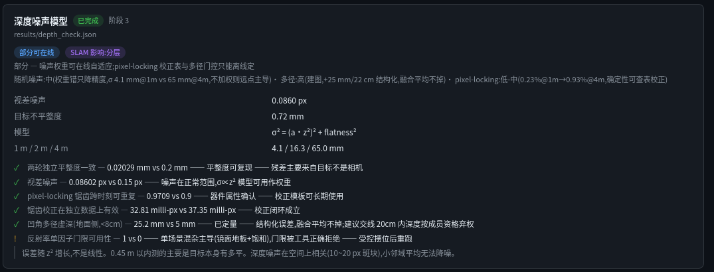
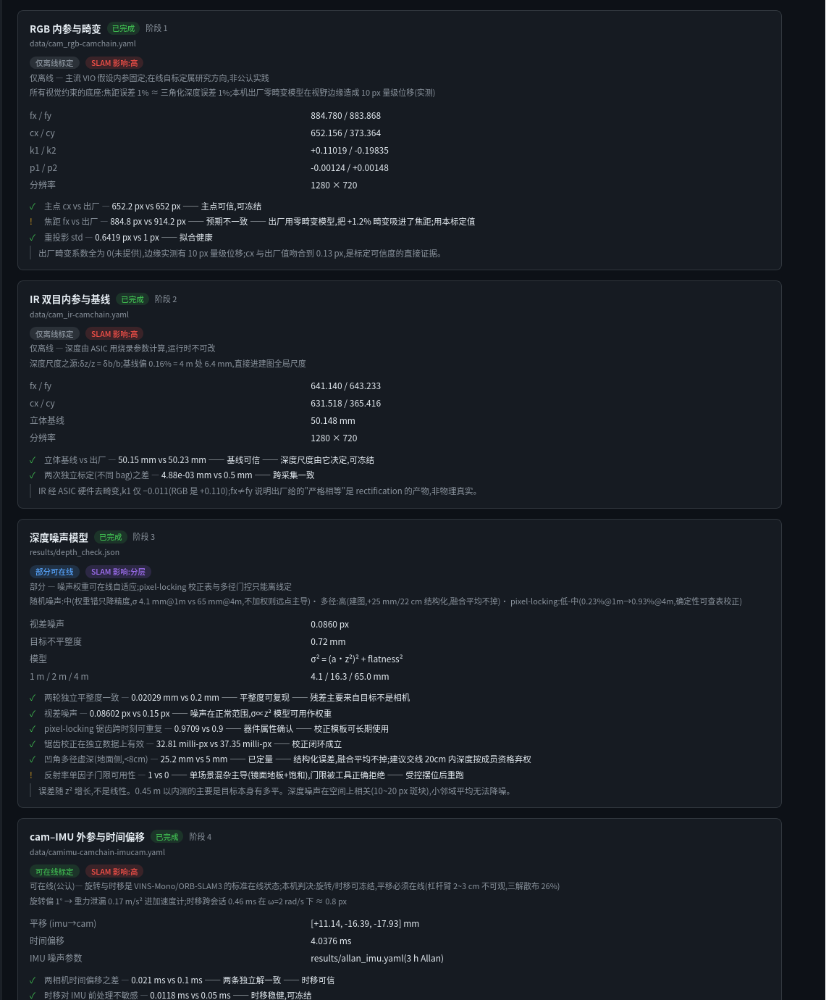

# RGBD-FullCalib

**目标是一个还不存在的东西:一站式多传感器标定工作台 —— 描述你的 rig,引导采集,
标完相机/IMU/LiDAR/跨传感器外参的一切,而且每个参数带着自己的判决回来:
对照优化之外的参照核查过、可视化过、坏数字在进你的 SLAM 栈之前就被标红。
v0.1 交付第一个完整实例:一台 D435i 从头标到尾;v0.2.0 已将其判决层
交付为 24 条声明式规则。[路线图](ROADMAP.md)走得远得多。**

[English README](README.md) · 完整实录 [CALIBRATION.md](CALIBRATION.md) ·
误差影响分析 [IMPACT_ANALYSIS.md](IMPACT_ANALYSIS.md) ·
[ROADMAP](ROADMAP.md) · [CHANGELOG](CHANGELOG.md)


标定这行最怕的不是误差大,是**看起来漂亮但错得一致**。重投影误差只说明模型拟合了
喂给它的数据,仅此而已。所以这里每个结果都对照一个**优化之外**的参照:出厂参数、
当地重力、多次独立采集、一把尺子。参数过不了核查,工具就直说,不让一个看起来漂亮的
坏数字混进 SLAM 栈。

## 这套 rig

<p align="center">
  
  
</p>
<p align="center"><sub>Intel RealSense D435i（fw 5.12.7.100，USB 3.2）· DFOPTIX <code>Tag6-320-35.2mm</code> 刚性 AprilGrid</sub></p>

靶标是成品板不是自己打印的 —— 这点很重要:排除了打印缩放这个误差源,
残差就能归到检测和相机身上,而不是尺子身上。`tagSpacing = 0.3` 经四方确认
(尺子实测白缝 10.6 mm、型号名反推、Kalibr 默认、重投影误差扫描在 0.30 处有明确极小)。

## 这要去哪

终点是现在市面上没有的那个工具:Kalibr 止步于视觉+IMU,厂商工具是黑盒,其余是
散装脚本和博客民科。这个仓库在公开地把它做出来 —— 判决层、影响分析器、坑知识库,
一版一版长。完整愿景与版本规划:[ROADMAP.md](ROADMAP.md)。

**v0.1(已交付)**:一台相机端到端(RGB 内参 → IR 双目 → RGB↔IR 外参 → 深度噪声
模型 → cam-IMU → 加速度计内参 → 温漂模型),全套工具、写在散文/GUI 代码里的手写
判决、GUI、15+ 条真实时间换来的坑。

**v0.2.0(已交付)**:上述核查已变成 24 条声明式规则,CLI、`REPORT.md`、GUI 卡片
共用一个引擎和一个事实源;加设备的判决项变成写规则,不是 fork 判决代码。

v0.3 的接缝已经在代码里:约一半工具本就与设备无关(英文 README 目录表里逐个
标注了),viewer 的源抽象层为「不是相机的传感器」而设计(协议里给在路上的 Mid-360
留了原生点云通道)。

### 拿你的相机来撞

在别的 RGB-D / 视惯 rig 上跑任一阶段撞了墙,把 traceback 开成 issue ——
v0.3+ 先抽象什么,由真实断点决定,不靠猜。有一个常驻 issue 就收这个。

## 结果速览

七项标定的参数、外部核查、判决,见 [English README](README.md#results-at-a-glance)
的速览表或 [CALIBRATION.md](CALIBRATION.md) 全文。机器可读结果在
[`data/*.yaml`](data) 与 [`results/*.json`](results)。

## 特意发表的负结果

- **本机 cam-IMU 平移标不出来**:三次独立解散布 24.6~31.7 mm,量本身才 ~26 mm。
  杠杆臂(IMU 距光心 2~3 cm)太短,手持激励喂不出可观测性。旋转和时移可冻结,
  平移只配当 VIO 初值。
- **六面静置法修不了动态残差**:同 bag 严格对照,只改加速度前处理,Kalibr 归一化
  残差基本不动 —— 静置内参是真的,但动态残差的主因是振动/模糊/同步抖动。
- **IMU 内参校正会耦合进外参旋转**(~0.9°):用哪套轴修正标的,部署就得用哪套。
- **主点温漂在本机是伪命题**(13°C 扫温 R²=0.07)—— 测了,证伪了,从担心清单划掉。
- **单姿态分离不了 bias/scale/非正交**:我试了,得到一个自信且错误的标度结论;
  12 姿态之后真凶是非正交。作为可辨识性陷阱的完整案例留档。

## 坑库

15+ 条完整故事在 [CALIBRATION.md](CALIBRATION.md) 的「采集踩过的坑」章,
一行版摘要见 [English README](README.md#pitfalls-that-cost-real-hours)。

## v0.2.0 已交付:判决层变成数据



```bash
python -m verdicts                      # 终端判决
python -m verdicts --md REPORT.md       # Markdown 报告(已入库)
```

原来以散文形式写在文档和 GUI 代码里的每一条核查,现在都在
[`verdicts/rules_d435i.yaml`](verdicts/rules_d435i.yaml) —— 24 条规则,每条 =
{取值表达式, 外部参照, 容差, 行动指令},由 ~200 行引擎执行,CLI 报告、
REPORT.md、GUI 卡片同一事实源。缺文件显示为"待数据",标了一半也能出报告。
加设备的判决项 = 写规则,不是 fork 判决代码。

机器检验散文第一天就有收获:旧文案"五次独立测量基线"被抓出**假独立** ——
Kalibr 的 imu-camera 阶段逐位继承相机链,五个数里三个是复制品。真实证据是
"两次独立标定(不同 bag)",差值 0.005 mm;yaml 里留了注释讲原因。

## GUI

WebGL2 点云查看器,三页签:实时点云(16-bit 深度 WebSocket 流、shader 内反投影)、
标定结果(判决卡片,直接从 yaml/json 生成;每张卡带两枚 SLAM 徽章:**能否在线标定**
(外参旋转/时移/IMU 零偏是 VINS 类系统的标准在线状态,内参与深度链不是)与
**对 SLAM 影响定级**,每一级背后是实测传播数字)、待办占位。温漂补偿一个勾选框
直接作用到实时点云。



```bash
cd viewer
python server.py --source d435i --alt-emitter   # 实机 + 发射器交替帧
python server.py --source synthetic             # 无相机也能跑
# 浏览器打开 http://localhost:8080    (?static=1 是可截图的静态模式)
```

## 在你自己的 D435i 上复现

1. `pip install -r requirements.txt`(Python ≥3.10,**不需要装 ROS**)
2. 构建 Kalibr 镜像:先把 [ethz-asl/kalibr](https://github.com/ethz-asl/kalibr)
   clone 到 `kalibr/`,然后 `docker build -t kalibr:noetic -f kalibr/Dockerfile_ros1_20_04 kalibr/`
3. 打印 AprilGrid,**用尺子实测** tag 尺寸和间距,改 yaml
4. 采集 → 标定 → **先看判决行再决定信不信** —— 每个阶段的确切命令在
   [CALIBRATION.md](CALIBRATION.md) 末尾「复现」章

注意:本仓库数字来自一台 fw 5.12.7.100 的 D435i(USB 3.2)。你的机器数字**一定**
不同 —— 这正是要标定的原因。

## 为什么连"影响"也发

[IMPACT_ANALYSIS.md](IMPACT_ANALYSIS.md) 把每项实测误差传播到建图/定位量级
(含 Mid-360 雷视对照列),组织原则只有一条:把误差分成 零均值随机 / 恒定系统性 /
**状态依赖系统性** —— 第三类毁地图(温漂深度尺度拼出双层墙),第二类静默卡死
图内定位。它还把待办标定按影响重排了序:只标你的应用真正感觉得到的量,能省几天。

## 路线图速览

**v0.2.0(已交付)** 声明式判决引擎 · **v0.3(下一版)** Mid-360 进场,雷视-IMU 跨传感器全链 ·
**v0.4** 更多 RGB-D 家族,rig 变描述文件 · **v0.5** 影响分析器工具化(输入你的工况,
输出你的一阶误差项) · **v1.0** 引导式采集 + 标定回归检测 + 按症状搜索的坑库 ——
工作台成形,届时仓库改名(GitHub 自动重定向)。详见 [ROADMAP.md](ROADMAP.md)。

## License

MIT — 见 [LICENSE](LICENSE)。
